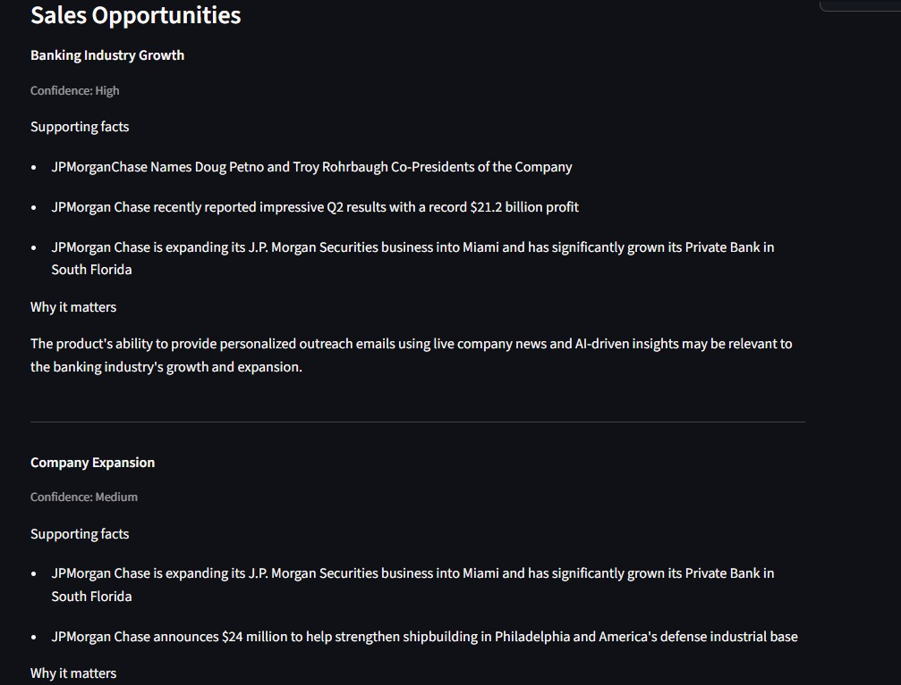
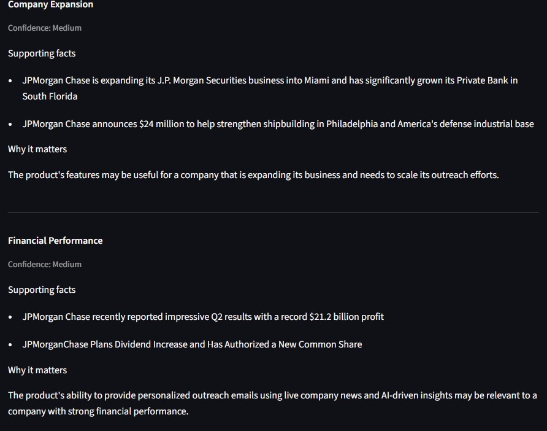
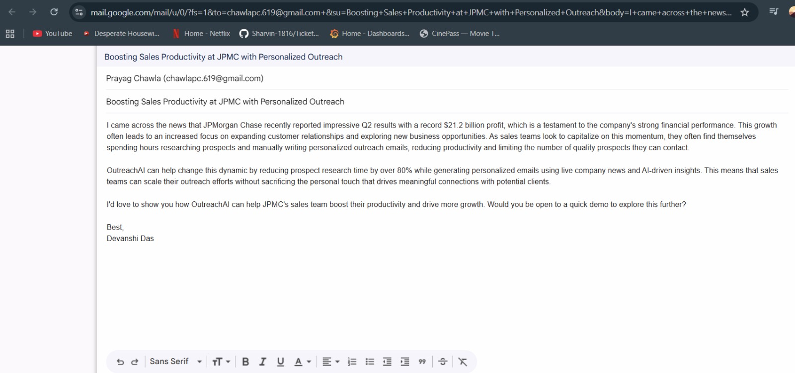

# Multi-Agent AI Sales Outreach Platform

<p align="center">


</p>

<p align="center">

### **Research-Driven Multi-Agent AI Platform for Intelligent Sales Outreach**

Automate prospect research, identify sales opportunities, generate highly personalized outreach emails, review email quality, and create Gmail-ready drafts using an autonomous AI workflow.

</p>

---

# Overview

Modern sales teams spend a significant amount of time researching prospects before writing personalized emails. Generic AI email generators often produce convincing language, but they lack factual grounding and meaningful personalization.

This project addresses that problem by combining **live web research**, **multi-agent collaboration**, and **LLM orchestration** into a structured pipeline that generates research-backed sales emails instead of relying on a single prompt.

Rather than asking one LLM to perform every task, the workflow decomposes the process into specialized AI agents responsible for research, analysis, writing, and review.

This architecture improves:

- Research quality
- Personalization
- Explainability
- Factual grounding
- Email quality
- User control

---

# Problem Statement

Traditional AI email generators typically follow this workflow:

```
Prompt
│
▼

LLM

│
▼

Email
```

This approach often leads to:

- Generic personalization
- Hallucinated company information
- Weak business context
- Poor relevance
- Little transparency into the research process

---

# Proposed Solution

The platform follows a **Research-First Multi-Agent Architecture**.

Each AI agent performs a specialized task before handing structured output to the next stage.

```
User Input
│
▼

Research Agent

│
▼

Sales Insight Agent

│
▼

Email Writer Agent

│
▼

AI Reviewer Agent

│
▼

Interactive Dashboard

│
▼

Gmail Draft
```

Instead of asking the LLM to "write a cold email," the system first discovers relevant business information and then uses that research to produce personalized outreach.

---

# Key Features

## Multi-Agent AI Workflow

The platform decomposes the outreach process into independent AI agents that collaborate sequentially using CrewAI.

---

## Live Prospect Research

Collects publicly available information including:

- Company announcements
- Funding
- Product launches
- AI initiatives
- Strategic partnerships
- Leadership updates
- Industry developments
- Public prospect information

---

## Sales Opportunity Identification

Transforms raw company research into actionable business opportunities by identifying:

- Growth initiatives
- Expansion activities
- Digital transformation
- AI adoption
- Hiring trends
- Customer engagement initiatives

---

## Personalized Email Generation

Generates cold outreach emails using:

- Prospect information
- Company research
- Product information
- Business opportunities
- User-selected tone
- Outreach objective

Every email is generated using verified research rather than generic assumptions.

---

## AI Email Reviewer

Automatically reviews the generated email for:

- Personalization
- Clarity
- Tone
- Relevance
- Call-to-action quality

and assigns an overall quality score.

---

## Interactive Dashboard

The Streamlit dashboard allows users to:

- Configure sender information
- Configure prospect information
- Define product/service
- Customize outreach objectives
- View research findings
- Explore sales opportunities
- Edit generated emails
- Generate Gmail drafts

---

## Gmail Draft Integration

Generated emails can be exported directly into Gmail as editable drafts before sending.

---

# System Architecture

```
                    ┌─────────────────────────────┐
                    │      Streamlit Dashboard    │
                    └──────────────┬──────────────┘
                                   │
                                   ▼
                     User Configuration & Inputs
                                   │
                                   ▼
                     ┌─────────────────────────┐
                     │    Research Agent       │
                     └─────────────┬───────────┘
                                   │
                                   ▼
                    Company Research + Prospect Data
                                   │
                                   ▼
                     ┌─────────────────────────┐
                     │ Sales Insight Agent     │
                     └─────────────┬───────────┘
                                   │
                                   ▼
                     Sales Opportunities & Insights
                                   │
                                   ▼
                     ┌─────────────────────────┐
                     │   Email Writer Agent    │
                     └─────────────┬───────────┘
                                   │
                                   ▼
                     Personalized Cold Email
                                   │
                                   ▼
                     ┌─────────────────────────┐
                     │   AI Reviewer Agent     │
                     └─────────────┬───────────┘
                                   │
                                   ▼
                          Final Email Output
                                   │
                                   ▼
                         Gmail Draft Generation
```

---

# AI Workflow

```
User Input

↓

Prospect Research

↓

Business Opportunity Detection

↓

Research Validation

↓

Personalized Email Generation

↓

Email Quality Review

↓

Editable Preview

↓

Open Gmail Draft
```

---

# Technical Highlights

This project demonstrates practical implementation of:

- Multi-Agent AI Systems
- Agentic AI Workflows
- LLM Orchestration
- Prompt Engineering
- Research-Grounded Generation
- AI Workflow Automation
- Human-in-the-Loop AI
- Explainable AI
- Sales Intelligence Automation
- Streamlit Application Development
- API Integration
- Pydantic Data Validation
- Modular Software Architecture
- Autonomous Task Coordination
- Live Web Search Integration

---

# Why This Project Stands Out

Unlike conventional AI email generators, this platform:

- Performs live research before generating emails
- Separates reasoning into specialized AI agents
- Provides transparent research evidence
- Identifies sales opportunities automatically
- Allows users to review and edit generated content
- Maintains a modular and extensible architecture
- Produces Gmail-ready outreach drafts

The result is a more reliable, explainable, and research-backed sales outreach workflow.

# AI Agents

The platform is built around a modular multi-agent architecture where each agent has a dedicated responsibility within the outreach pipeline. Rather than relying on a single LLM prompt, specialized agents collaborate to produce a research-backed and personalized outreach email.

---

## Research Agent

**Objective**

Collect accurate, up-to-date information about the prospect and their organization.

### Responsibilities

- Perform live web searches
- Identify recent company news
- Gather publicly available prospect information
- Collect product launches, partnerships, funding announcements and strategic initiatives
- Filter irrelevant search results
- Return structured JSON for downstream agents

### Output

```json
{
  "company_news": [],
  "product_relevant_findings": [],
  "prospect_information": {},
  "industry": "",
  "sources": []
}
```

---

## Sales Insight Agent

**Objective**

Transform raw research into meaningful business opportunities.

Rather than simply summarizing research, this agent analyzes how recent company developments relate to the product or service being offered.

### Responsibilities

- Analyze company initiatives
- Detect potential sales opportunities
- Connect research with business needs
- Organize supporting evidence
- Generate confidence levels

### Example

Research

```
Company launched a large-scale AI initiative.
```

Business Opportunity

```
The organization is actively investing in AI transformation,
making workflow automation solutions potentially relevant.
```

---

## Email Writer Agent

**Objective**

Generate a personalized outreach email using validated research.

The writer receives:

- Sender information
- Prospect information
- Product information
- Business opportunities
- Outreach goal
- Tone
- Email length
- Additional instructions

The writer never performs research itself.

This separation improves factual grounding while reducing hallucinations.

---

## Reviewer Agent

**Objective**

Evaluate the generated email before delivery.

The reviewer analyzes:

- Personalization
- Relevance
- Tone
- Clarity
- Call-to-action
- Overall quality

It also produces a reviewer score together with actionable feedback before the email is finalized.

---

# Technology Stack

## Artificial Intelligence

- CrewAI
- Groq LLM
- LiteLLM

CrewAI orchestrates the collaboration between specialized AI agents, while Groq provides high-performance inference for language generation.

---

## Backend

- Python
- Pydantic
- Requests

Pydantic is used for structured validation of user inputs and inter-agent data exchange.

---

## Frontend

- Streamlit

The application is delivered through an interactive Streamlit dashboard that enables users to configure outreach campaigns, inspect research findings, review generated emails, and create Gmail drafts.

---

## External APIs

### Serper API

Used for live web search to gather:

- Company news
- Prospect information
- Industry developments
- Supporting references

---

### Gmail Draft Integration

Automatically prepares a Gmail draft populated with the generated outreach email, allowing users to review and send it directly from Gmail.

---

# Dashboard Walkthrough

## Sender & Prospect Configuration

The dashboard collects sender information, prospect details, and contact information required for personalized outreach.


---

## Product Configuration

Users define the product or service being offered by specifying:

- Product name
- Category
- Target customer
- Business problem
- Primary value proposition
- Product description

These inputs allow the AI agents to generate context-aware research and personalized messaging.


---

## Outreach Configuration

The platform supports configurable outreach preferences, including:

- Outreach objective
- Email tone
- Email length
- Additional instructions

These settings influence the writing agent while preserving factual grounding from the research pipeline.


---

## Research Dashboard

After execution, the dashboard displays:

- Verified company news
- Supporting sources
- Reviewer score
- Generated email

This provides transparency into the reasoning process and allows users to verify the information used during email generation.


---

## Sales Opportunity Detection

Instead of exposing raw research, the platform identifies business opportunities supported by factual evidence collected during the research stage.

Each opportunity includes:

- Opportunity title
- Supporting facts
- Business relevance
- Confidence score



---

## Opportunity Analysis

Business opportunities are organized into structured sections to help users understand why the platform recommends a particular outreach strategy.

Supporting evidence is presented alongside each opportunity, making the generated email more explainable and easier to validate.



---

## Gmail Draft

The final email can be exported directly into Gmail as a pre-filled draft, allowing users to make final edits before sending.



---

# Project Structure

```
Multi-Agent-AI-Sales-Outreach-Platform
│
├── app.py
│   ├── Streamlit dashboard
│   ├── User interface
│   └── Gmail draft generation
│
├── main.py
│   ├── Pipeline orchestration
│   ├── Agent execution
│   └── Workflow management
│
├── agents.py
│   ├── Research Agent
│   ├── Sales Insight Agent
│   ├── Email Writer Agent
│   └── Reviewer Agent
│
├── tasks.py
│   ├── Research Tasks
│   ├── Sales Insight Tasks
│   ├── Writing Tasks
│   └── Review Tasks
│
├── tools.py
│   └── Serper API integration
│
├── models.py
│   └── Pydantic request models
│
├── config.py
│   └── Environment configuration
│
├── requirements.txt
├── README.md
├── .env.example
├── .gitignore
│
├── assets
│   ├── Dashboard_1
│   ├── Dashboard_2
│   ├── Dashboard_3
│   ├── Dashboard_4
│   ├── Dashboard_5
│   ├── Dashboard_6
│   └── GMAIL_PAGE
│
└── output
    └── Generated emails
```

---

# Installation

## Clone the Repository

```bash
git clone https://github.com/<your-github-username>/Multi-Agent-AI-Sales-Outreach-Platform.git
```

Move into the project directory.

```bash
cd Multi-Agent-AI-Sales-Outreach-Platform
```

---

# Create a Virtual Environment

Windows

```bash
python -m venv venv
venv\Scripts\activate
```

Linux / macOS

```bash
python3 -m venv venv

source venv/bin/activate
```

---

# Install Dependencies

```bash
pip install -r requirements.txt
```

---

# Environment Variables

Create a file named `.env`

```
GROQ_API_KEY=YOUR_GROQ_API_KEY

SERPER_API_KEY=YOUR_SERPER_API_KEY

GROQ_MODEL=llama-3.3-70b-versatile

LLM_TEMPERATURE=0.3

OUTPUT_DIR=output

MAX_RPM=4

WRITER_MAX_ATTEMPTS=2
```

---

# API Keys

The project requires two external services.

## Groq

Used for LLM inference.

Generate an API key from

https://console.groq.com/

---

## Serper

Used for live Google Search.

Generate an API key from

https://serper.dev/

---

# Running the Application

Launch the Streamlit dashboard.

```bash
streamlit run app.py
```

The application will be available at

```
http://localhost:8501
```

---

# How It Works

The application follows a sequential AI workflow.

```
User Configuration

↓

Research Agent

↓

Company Intelligence

↓

Sales Opportunity Analysis

↓

Personalized Email Generation

↓

AI Email Review

↓

Interactive Dashboard

↓

Gmail Draft
```

---

# Input Parameters

The dashboard accepts the following inputs.

### Sender Information

- Name
- Company
- Designation
- Email

---

### Prospect Information

- Name
- Company
- Designation
- Email

---

### Product Information

- Product Name
- Category
- Target Customer
- Problem Solved
- Primary Benefit
- Product Description

---

### Outreach Configuration

- Outreach Goal
- Tone
- Email Length
- Additional Instructions

---

# Generated Outputs

For every request, the platform produces

- Live Company Research
- Prospect Intelligence
- Sales Opportunities
- Supporting Sources
- AI Reviewer Score
- Personalized Cold Email
- Gmail Draft

---

# Design Principles

The platform follows several architectural principles.

### Separation of Responsibilities

Each AI agent performs one specialized task.

---

### Modular Design

Research, analysis, writing and review are independent components.

---

### Research-Driven Generation

Emails are generated using live research instead of relying solely on prompt engineering.

---

### Explainability

Users can inspect the research and sales opportunities before reviewing the generated email.

---

### Human-in-the-Loop

Generated emails remain editable before being exported to Gmail.

---

# Performance Characteristics

- Modular multi-agent pipeline
- Sequential task execution using CrewAI
- Structured data exchange using Pydantic models
- Research-backed personalization
- Configurable prompts
- Extensible architecture for additional agents
- Interactive dashboard for end users

---

# Current Limitations

- Supports one prospect at a time
- Gmail draft generation (direct sending not yet implemented)
- Depends on external APIs for research
- Requires active internet connectivity
- Research quality depends on publicly available information

---
# Technical Concepts Demonstrated

This project demonstrates the practical application of several modern AI engineering concepts and software design principles.

### Artificial Intelligence

- Multi-Agent AI Systems
- Agentic AI Workflows
- LLM Orchestration
- Prompt Engineering
- Research-Grounded Content Generation
- AI-Assisted Decision Making

### Software Engineering

- Modular System Design
- Object-Oriented Programming
- Pipeline Architecture
- Configuration Management
- API Integration
- Error Handling
- Data Validation

### Data & Research

- Live Web Search Integration
- Sales Intelligence Collection
- Prospect Research
- Information Extraction
- Structured JSON Pipelines

### Frontend

- Interactive Streamlit Applications
- User Input Validation
- Dynamic Dashboard Design
- Human-in-the-Loop Editing

---


# Skills Demonstrated

This project showcases experience with:

### AI Engineering

- Multi-Agent AI Design
- CrewAI
- LLM Orchestration
- Prompt Engineering
- AI Workflow Automation

### Backend Development

- Python
- API Development
- Environment Configuration
- Modular Architecture
- Pydantic Models

### Frontend Development

- Streamlit
- Interactive Dashboards
- State Management
- User Experience Design

### External Services

- Groq API
- Serper Search API
- Gmail Integration

---

# Challenges Solved

During development, several engineering challenges were addressed:

- Coordinating multiple AI agents through a sequential workflow
- Structuring inter-agent communication using validated data models
- Reducing repetitive and generic email generation
- Grounding generated emails using live research
- Designing an explainable AI workflow with transparent research outputs
- Building an interactive interface for configuring outreach campaigns

---

# Use Cases

The platform can support workflows such as:

- B2B Sales Outreach
- Lead Generation
- Business Development
- Partnership Outreach
- Product Demonstrations
- Enterprise Prospecting
- Startup Sales
- Recruitment Outreach
- Networking Emails

---

# Repository Highlights

- Modular multi-agent architecture
- Live web research
- Research-backed personalization
- Explainable AI workflow
- Interactive Streamlit dashboard
- Gmail draft generation
- Configurable outreach settings
- Extensible project structure

---

# Contributing

Contributions are welcome.

If you would like to improve the platform:

1. Fork the repository
2. Create a feature branch

```bash
git checkout -b feature/your-feature
```

3. Commit your changes

```bash
git commit -m "Add new feature"
```

4. Push your branch

```bash
git push origin feature/your-feature
```

5. Open a Pull Request

---

# License

This project is licensed under the MIT License.

See the `LICENSE` file for more information.

---

# Author

**Devanshi Das**

Electronics & Computer Engineering

Interests

- Artificial Intelligence
- Agentic AI
- Cloud & Infrastructure
- Data Analytics
- Machine Learning
- Software Engineering

GitHub

https://github.com/<your-username>

LinkedIn

https://linkedin.com/in/<your-linkedin>

---

# Acknowledgements

This project was built using several open-source technologies.

- CrewAI
- Streamlit
- Groq
- LiteLLM
- Serper API
- Pydantic
